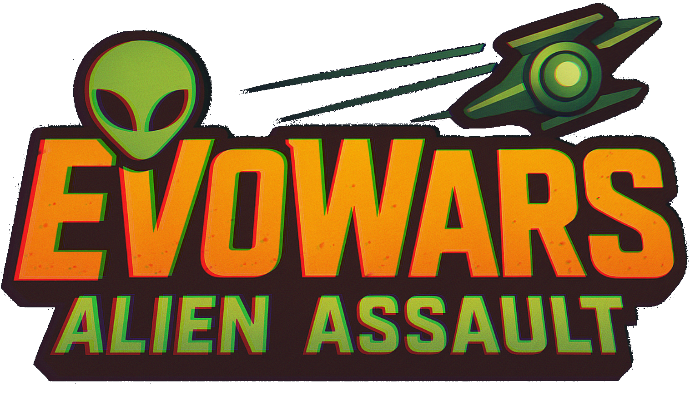
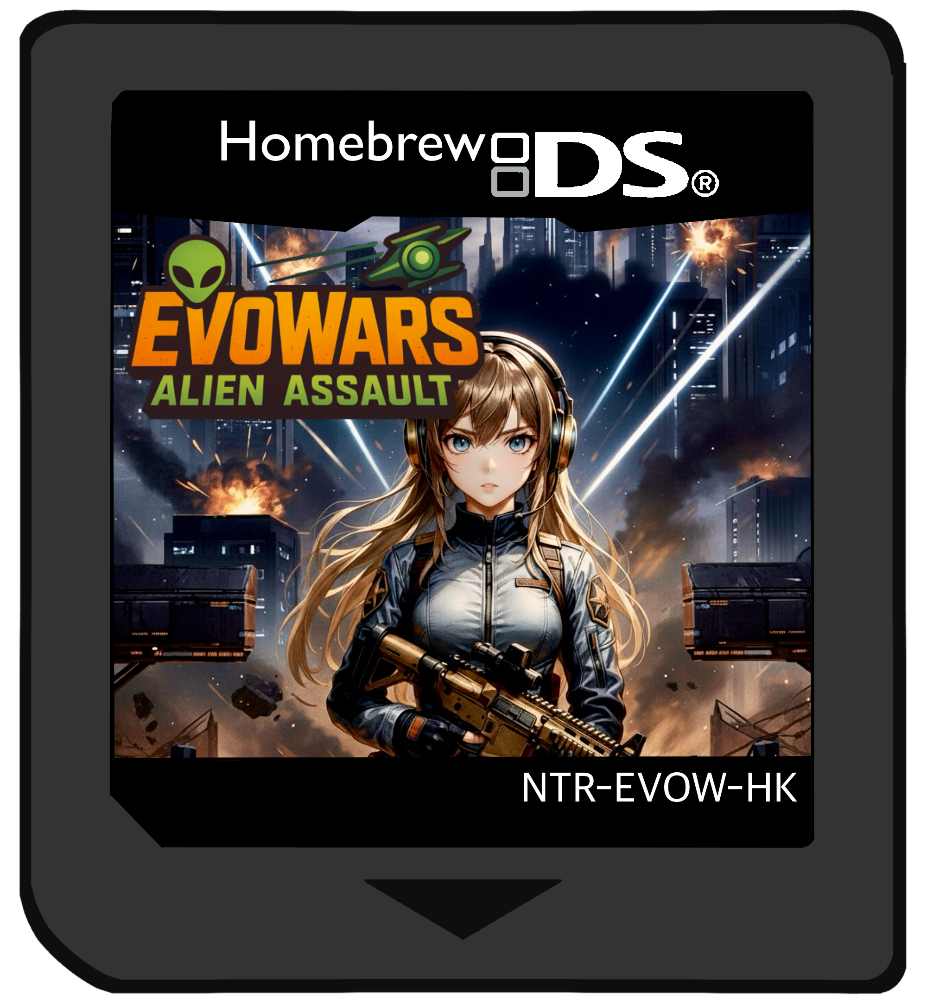
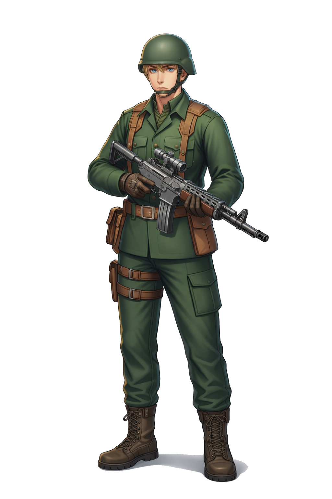

# EvoWars:AlienAssualt 
**© 2026 Jung Yoomin. All Rights Reserved.**

---

    
	

## Nintendo DS Homebrew Game Commercial Showcase 

> Commercial Nintendo DS homebrew action shooter
> featuring era-based progression and real-time combat.

This project focuses on
AI behavior modeling, system design, and data-driven decision-making
under strict hardware constraints.

---
## 🎯 Project Purpose

This repository exists as a **supporting portfolio project** demonstrating applied AI and system-level thinking through a **real, constrained production environment**.

The project explores how:
- Intelligent enemy behavior
- Difficulty balancing
- Real-time decision systems  

can be designed with a Behaviour tree.

---

## 🕹️ Project Overview

- **Platform:** Nintendo DS (Homebrew)
- **Genre:** Third-Perspective shooter
- **Core Theme:** Alien combat with tactical positioning
- **Status:** Commercial release planned (homebrew market)

### character Profile

	
    
	

The source code is public, however, due to commercial considerations, the source code is a closed source.  
This repository documents **design decisions, trade-offs, and analytical reasoning**.

---

## 🤖 AI & Decision System Design

Enemy Behavior Modeling
	•	Finite State Machines (FSM) combined with weighted scoring
	•	Action selection influenced by:
	•	Player exposure duration
	•	Distance to target
	•	Enemy health state
	•	Controlled stochastic variation

Conceptual model:

Action Score =
  0.4 × Distance Factor +
  0.3 × Player Exposure Time +
  0.2 × Enemy Health +
  0.1 × Random Noise

This approach ensures:
	•	Predictable baseline behavior
	•	Non-repetitive encounters
	•	Low computational overhead

⸻

Cover-Based Combat Logic
	•	Player state abstraction:
	•	Cover
	•	Aim
	•	Reload
	•	Exposed
	•	Enemy aggression dynamically responds to player risk state
	•	Encourages tactical timing rather than brute-force output

The system parallels policy-driven decision logic often used in applied AI systems.

⸻

Data-Driven Difficulty Design

Gameplay balance was tuned using offline simulations and synthetic player modeling, compensating for the lack of large-scale runtime telemetry.

Included analyses:
	•	Player reaction-time distributions
	•	Enemy spawn density vs. failure probability
	•	Difficulty curve stabilization

These analyses demonstrate how data science techniques can guide system tuning even in resource-limited environments

---

## Performance & Constraint-Aware Engineering

Key constraints:
	•	~4MB system memory
	•	Limited CPU throughput
	•	Fixed frame budget

Engineering responses:
	•	Deterministic AI update cycles
	•	Memory-aligned data layouts
	•	Frame-budgeted logic evaluation
	•	VRAM-conscious asset management

Every feature was evaluated for cost vs. behavioral benefit, mirroring real-world AI system optimization.

⸻

Repository Structure

├── docs/
│   ├── architecture.md
│   ├── nds-constraints.md
│   ├── ai-behavior-design.md
│   ├── game-system-design.md
│   └── performance-optimization.md
│
├── data-analysis/
│   ├── player-simulation.ipynb
│   ├── difficulty-balancing.ipynb
│   └── spawn-rate-analysis.ipynb
│
└── media/
    ├── gameplay.gif
    ├── boss-fight.mp4
    └── debug-overlay.png

⸻
## © Copyright Notice

**© 2026 Jung Yoomin. All Rights Reserved.**

This repository and all its contents—including source code, documentation, design documents, data analysis files, images, videos, and gameplay previews—are protected by copyright law.

### Intellectual Property Statement

- The game **EvoWars: Alien Assault** is a commercial Nintendo DS homebrew project.
- All rights to the game concept, source code, gameplay mechanics, visual assets, audio assets, AI systems, design documents, and branding are exclusively owned by **Jung Yoomin**.
- The full source code is publicly visible in this repository **for portfolio and demonstration purposes only**.
- This repository serves as a **public showcase** of the project's architecture, AI behavior modeling, system design, and technical implementation.

### Permitted Use

You may view, read, fork, and share the contents of this repository (including source code) for **personal, educational, or portfolio review purposes only**, provided that:
- Proper attribution is given to **Jung Yoomin** and the project **EvoWars: Alien Assault**.
- No commercial use, modification, redistribution, or creation of derivative works is made without explicit written permission from the copyright holder.

### Restrictions

The following actions are strictly prohibited without prior written consent:
- Using any part of the source code in other projects (commercial or non-commercial)
- Modifying, distributing, sublicensing, or publicly hosting modified versions of the code
- Incorporating the code, assets, or design into any product or derivative work
- Commercial exploitation of the codebase, documentation, or assets

Any unauthorized use may result in legal action.

---

Summary

This project demonstrates:
	•	AI behavior modeling under extreme constraints
	•	Data-informed system tuning without heavy ML dependencies
	•	Real-time decision systems with predictable performance

It serves as a supporting example of applied AI engineering, complementing larger or more ML-focused portfolio projects.

